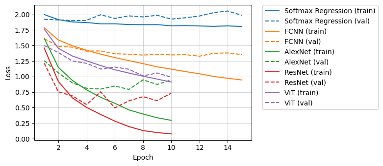
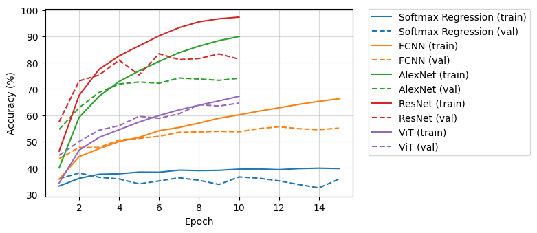

# Phân loại hình ảnh sử dụng các phương pháp học máy và học sâu

Triển khai và đánh giá các mô hình phân loại trên bộ dữ liệu CIFAR-10.

Các mô hình được lựa chọn bao gồm:
- Softmax Regression
- Mạng neuron truyền thẳng (Fully Connected Neural Network)
- AlexNet
- ResNet
- Vision Transformer

Chi tiết triển khai và kết quả trong [báo cáo](assets/it3150_project_report.pdf).

## Kết quả nổi bật

- #### Giá trị hàm mất mát của mỗi mô hình qua các epoch

 

- #### Độ chính xác của mỗi mô hình qua các epoch

- #### Độ chính xác của mỗi mô hình trên tập test

| Mô hình             | Độ chính xác (%) | Thời gian epoch trung bình (s) |
| ------------------- | :---------------:| :----------------------------: |
| Softmax Regression  | 36.09            | **10.26**                      |
| FCNN                | 54.87            | 11.41                          |
| AlexNet             | 73.76            | 73.67                          |
| ResNet              | **81.16**        | 134.11                         |
| ViT                 | 64.55            | 90.86                          |
